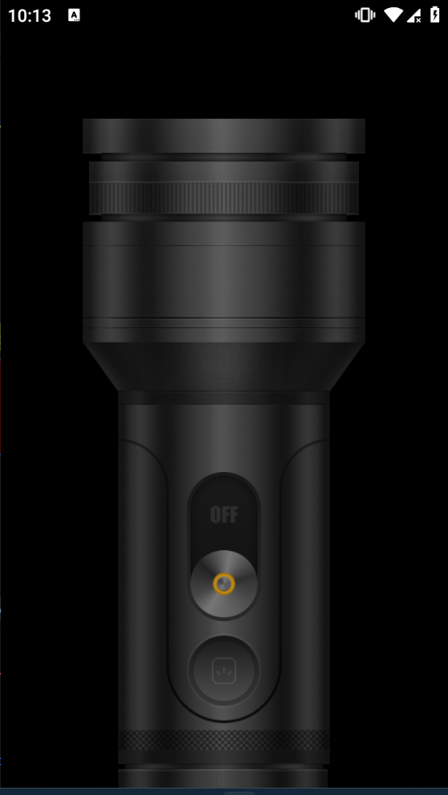

# Flashify

**Flashify** is a sleek and responsive Flutter app that transforms your device into a flashlight controller. With just a tap, you can toggle your flashlight or enable automatic flashing—perfect for fun, utility, or emergencies.

---

## 🎯 Features

- **Torch Control**: Instantly turn your flashlight on or off.
- **Auto-Toggle Mode**: Flash your torch at 1-second intervals for attention-grabbing effects.
- **Intuitive UI**: A user-friendly interface with a visually appealing design.
- **Seamless Performance**: Built with Flutter and Bloc for smooth functionality.

---

## 🖼️ Screenshots

### Home Screen

